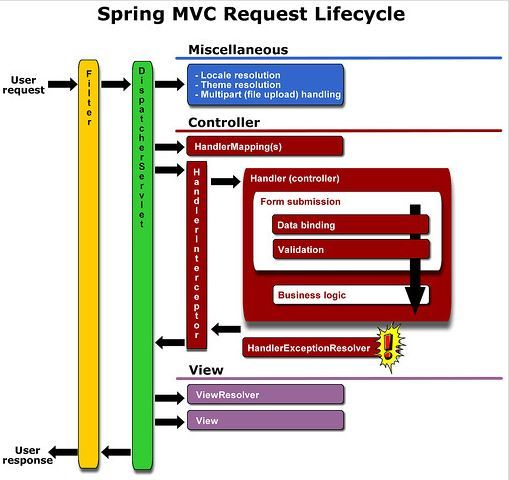

# OZ 학습 주제

## Interceptor

### Interceptor란 ?
클라이언트가 서버의 특정 URL을 요청할 때에 Controller로 가는 요청을 가로채는 역할을 하는 아이

### 왜 써야 하는건가 ?
만약 클라이언트에서 로그인이 먼저 수행되어야 하는 어떤 페이지를 서버에 요청한다고 가정을 해보자.
 
이때, Spring MVC에서 클라이언트의 요청은 Controller를 통해서 받게 된다. 그러므로 클라이언트의 요청을 받은 해당 Controller에서 사용자가 로그인이 되어있는지에 대한 `검사`를 해야 한다. 

예를 들면, `해당 유저의 세션`을 검사 할 수 있을 것이다.

그렇다면, 이런 로그인이 필요한 페이지들이 여러개일 경우 해당 Controller에 수행되는 로직은 계속해서 늘어날 것이다.

`같은 기능을 하는 코드의 중복`인 것이다.

이런 상황에서 Controller로 오는 모든 요청 혹은 일부 조건의 요청들을 중간에서 가로채 수행 할 수 있게끔 해주는 역할이 `Interceptor`인 것이다.

### Filter VS Interceptor

#### 유사점

1. `Filter`와 `Interceptor`은 처리 방식에 있어서는 서로 동일하다.
2. 비즈니스 로직을 처리하기 전에 처리해야할 전처리 혹은 비느지스 로직을 수행 한 후에 해야 할 후처리 작업등을 수행하게 할수 있다.
4. 지정된 `Request`에 대해서만 `Filter`나 `Interceptor`가 동작하도록 제어할 수 있다.
5. 둘다 설정파일에 기술한 순서대로 실행이 된다.

#### 차이점

1. `Filter`는 Dispatcher Servlet 앞단에서의 정보를 처리한다.

2. `Interceptor`는 Dispatcher Servlet에서 Controller로 가기 전에 정보를 처리한다.

3. `Filter`는 `J2EE 표준 스펙에 정의 되어 있는 기능`이다.

4.  `Interceptor`는 `Spring Framework`에서 자체적으로 제공하는 기능이다. 그렇기 때문에, `Spring Bean`을 받아올 수 있다. 



Filter와의 `처리 시점`이 다르다.

클라이언트 요청에 대한 `처리 시점`

1. 브라우저가 요청한다.

2. **Filter**에 들어온다.

3. Dispatcher Servlet으로 들어온다.

4. **Intercepter**로 들어온다.

5. Controller로 들어온다.

6. 다시 **Intercepter**로 들어온다.

7. 다시 Dispatcher Servlet으로 들어온다.

8. 다시 **Filter**에 들어온다.

9. 브라우저에게 응답한다.


### 그렇다면 언제 사용하는 것이 적절한가 ?

1. 요청 경로마다 접근 제어를 다르게 할 때에
	- 요청 경로마다 접근이 가능 한 사용자인지, 아닌지에 대한 판별이 필요할 때에, 예를 들어, 관리자와 사용자의 접근 제어 수준이 다를 수 있는 페이지를 요청한다던지 했을 때에

2. 특정 URL을 요청할 때마다 접근 내역을 기록하고 싶을 때에
	- Interceptor를 통해 특정 URL에 접속하는 유저들의 정보나 로그등을 남기고 싶을 때에 나중의 페이지 분석을 위해서 ? 

3. 로그인 체크
	- 아까 예로든 로그인을 체크할 때에, 여러개일 수록 Interceptor가 필요로하는 데이터에 페이지 정보만 추가해주면 자동으로 Interceptor가 검사하기 때문에 편리하게 관리 할 수 있다.

[출처 : Cocomo Coding](http://cocomo.tistory.com/199)

## MessageConvertor

### MessageConvertor 란?
Spring MVC를 이용해서 클라이언트와 서버간에 HTTP요청과 응답을 할때에, Controller를 통해서  값을 주고 받는데, 이 때 Spring에서 클라이언트의 HTTP 요청을 분석하여 그에 따라 내부의 적절한 특정 클래스로 값을 자동으로 바인딩 해주고, 비즈니스 로직을 수행 후, HTTP 응답객체 `Model Object` 를 View에 포함하여 리턴한다.

MessageConvertor는 HTTP 요청 메시지 본문과, 응답 메시지 본문을 하나의 메세지로 판단하여, 그것을 통째로 적절한 클래스를 찾아 바인딩해주는 것이다.

Spring MVC에서 이러한 역할을 하는 Anotation이 바로 `@RequestBody` 와 `@ResponseBody`이다.

### 어떻게 사용을 하면 되나 ?
먼저 기본으로 제공되는 MessageConvertor들의 종류를 간략하게 살펴보자.

1. byte []
2. String
3. Form (MultiValueMap<String, String>)
4. XML
5. JSON

기본으로 제공되는 MessageConvertor말고, 커스텀한 MessageConvertor를 만들어서 사용하려면, Spring MVC에서 사용할 수 있게 환경을 셋팅해주어야 한다.

[출처 : 사랑이 고픈 프로그래머..](http://zgundam.tistory.com/12)


## ArgumentResolver

### ArgumentResolver 란?

Spring에서 Contoller로 들어오는 parameter나 return type을 가공해서 사용하고 싶을 때가 있는데,

Spring에서 제공하는 `HandlerMethodArgumentResolver`를 이용해서 구현체를 작성하면, @CustomAnnotation을 사용해서 해당 paramter나 return type을 가공할 수 있다.

### 왜 써야 하는가?

```java
@RequestMapping("/test")
public String test(Member member) { ... }
```

위와 같은 코드에서 member 변수에는 무엇이 들어올지 알 수 없기 떄문에 Spring에서 제공하는 `HandlerMethodArgumentResolver`를 이용해서 member에 무슨 값이 들어갈지 직접 정의 해줄 수 있다.

또, Request의 파라메터 또는 헤더 값을 빼내서 그 객체를 만들 수도 있고 Session에서 값을 빼서 넣어 줄 수도 있기 때문에, 즉  

> Controller로 가기 전에 view에서 넘어온 데이터(정확히는 HttpRequest를 포함해서 다양한 일을 할 수 있지만)를 가공해서, Controller로 전달하기 위함

**공통적이 규약이 있을때 자주 사용합니다.**

### HandlerMethodArgumentResolver vs Model

`HandlerMethodArgumentResolver`는 Contoller로 오는 요청에 대한 데이터들을 특정 클래스로 객체화 시켜서 받는다.

`Model`은 개념적으로는 관심 영역에 대해 어플리케이션의 행동을 표현하는 UI에 종속적인 요소이므로 Contoller가 데이터를 jsp나 View로 필요한 데이터를 담아서 줄 때 사용하는 것이다.

전반적인 흐름을 보면, 

Request(data) -> HMAR -> Controller -> Model -> Response(model)


### 장단점

#### 단점

1. 외부에서 넘어온 request parmaeter나 path variable의 값이 object 에 맵핑되지 않는다. (modelAttribute 기능이 적용되지 않는다.)

2. hibernate validation 체크가 무시 된다.

[출처 : origoni's Blog](http://millky.com/@origoni/post/1177?language=ko_kr)

[출처 : {code that works}](https://sdqali.in/blog/2016/01/29/using-custom-arguments-in-spring-mvc-controllers/)
