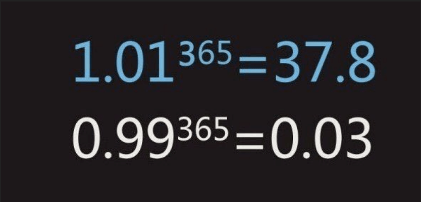

# 지적 프로그래밍을 위한 넓고 얕은 습관

우연히 유툽을 보다가. 추천 재생목록으로 나온 영상

[지적 프로그래밍을 위한 넓고 얕은 지식](https://youtu.be/aP9mhLBJMLw)

### 1. 아름다운 코드 작성 습관

* 코딩 컨벤션을 통해서 코드 작성 룰을 정한다.
    * 사람마다 스타일이 다르다. 그렇기 때문에 가독성과 유지보수 코드확장에 대한 어려움이 있을 수 있으므로 코딩 컨벤션을 통해서 이를 최대한 통일한다.
    * 예를 들면, javascript, jsx등은 airbnb의 코딩 컨벤션을 따른다.

* 코드리뷰를 통한 코드 작성
    * 자동화된 코드리뷰 - SONAR QUBE
        * 정적 코드 분석 툴
        * 7가지 기분을 통해 코드 품질 시각화
        * 웹페이지로 대시보드 및 코드 분석 결과 제공
    * 수동 코드리뷰
        * pair programming
        * github pull request
            * [PR Templates](https://github.com/blog/2111-issue-and-pull-requesttemplates)
        * pull approve 라는 도구를 통해서 .. 

코드리뷰를 통해서 얻는 이점 
- 코드 퀄리티 상승
- 막 코딩 방지 
- 좋은 코드, 생각지 못했던 좋은 방법 발견
- 장애 요소 미리 발견
- 팀코드 베이스 공감
- 코드 다시 검증
- 예쁜 스타일 (컨벤션) 학습
- 구조를 망가뜨리는 코드 방지
- Clean Code 역량 향상.. 등등

> 코드리뷰는 잔소리가 아닌 코드로하는 커뮤니케이션이다 ! 

### 2. 자동 검증 습관
PR을 받거나.. 코드리뷰 이후의 코드를 Merge했을 경우, 빌드를 하지 않고 미리 해야할 작업들을 하고나서 빌드 에러가나는 이슈.. 알고보니 리뷰한 코드의 에러라면 ?

* Continuous Intergration (CI) 지속적인 통합관리 시스템
    - Jenkins.io
    - Go.cd
    - travis-ci
* Code Quality
    - [codacy](http://github.com/integrations/codacy)
    - [codecov](http://github.com/integrations/codecov)

> 테스트 실패, 빌드 실패를 미리미리 대응! 코드 퀄리티 상승 및 코드에 대한 확신이 생겨서 좋음.

### 3. 성장하는 습관

* Follow 
    - Github, Twitter에서 유명한 핵유명한 개발자들을 follow 하자..
* blog들을 feed 받자
* 최신 트렌드를 읽자
    - [devnews](http://devnews.kr/)
* 컨퍼런스, 커뮤니티 활동들을 하자.
* 나만의 정리노트 혹은 정리 할 수 있는 무언갈 해라
* 배운 것을 스스로 정리하면서 나의 것으로 만들자

> * 누군가 한 걸음만 앞서도 뒤 따라오는 사람을 도울 수 있다.
> * 큰 컨퍼런스, 사내강연, 스터디, 온라인 발표, 옆사람 알려주기
> * 잘 못하고 이불킥해도 시도 조차 안하는 것 보단 낫다
> * 오늘 보다 내일이 0.01 더 노력하는 사람이 되자.

