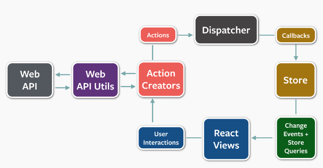

# FLUX

facebook에서 만들었다. JavaScript App을 빌드하는데에 사용하는 어플리케이션 아키텍쳐다.
단방향 데이터 흐름을 기본으로 하고, Flux로 작은 위젯부터 거대한 어플리케이션까지 모두 만들 수 있다.

### Flow

dispatcher는 싱글톤으로 만들어져있고, Flux앱에서 데이터 흐름의 중심허브 역할을 한다.
dispatcher는 기본적으로 콜백으로 등록하고, 순서대로 이러한 콜백을 호출할 수 있어요
dispatcherd에 새로운 데이터가 들어올때, store에 연결되어있는 것들에게 전파한다.

