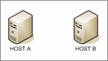

# TCP VS UDP

## TCP (Transmission Control Protocol)

* 연결 지향적 프로토콜 (connection oriented)
* 한번의 연결로 양뱡향 통신이 가능하다

## UDP (User Datagram Protocol)

* 비연결 지향적 프로토콜 (connectionless)
* Multiple messages are sent as packets in chunks using UDP
* 여러 메시지가 패킷 단위로 전송

### 차이점

|Differences|TCP|UDP|
|-----------|---|---|
|약어|Transmission Control Protocol|User Datagram Protocol or Universal Datagram Protocol|
|Connection|TCP is a connection-oriented protocol.|UDP is a connectionless protocol.|
|Function(기능)|As a message makes its way across the internet from one computer to another. This is connection based.|UDP is also a protocol used in message transport or transfer. This is not connection based which means that one program can send a load of packets to another and that would be the end of the relationship.|
|Usage(사용)|TCP is suited for applications that require high reliability, and transmission time is relatively less critical.|UDP is suitable for applications that need fast, efficient transmission, such as games. UDP's stateless nature is also useful for servers that answer small queries from huge numbers of clients.|
|Use by other protocols|HTTP, HTTPs, FTP, SMTP, Telnet|DNS, DHCP, TFTP, SNMP, RIP, VOIP.|
|Ordering of data packets|TCP rearranges data packets in the order specified.|UDP has no inherent order as all packets are independent of each other. If ordering is required, it has to be managed by the application layer.|
|Speed of transfer|The speed for TCP is slower than UDP.|UDP is faster because error recovery is not attempted. It is a "best effort" protocol.|
|Reliability|There is absolute guarantee that the data transferred remains intact and arrives in the same order in which it was sent.|There is no guarantee that the messages or packets sent would reach at all.|
|Header Size|TCP header size is 20 bytes|UDP Header size is 8 bytes.|
|Streaming of data|Data is read as a byte stream, no distinguishing indications are transmitted to signal message (segment) boundaries.|Packets are sent individually and are checked for integrity only if they arrive. Packets have definite boundaries which are honored upon receipt, meaning a read operation at the receiver socket will yield an entire message as it was originally sent.|
|Weight|TCP is heavy-weight. TCP requires three packets to set up a socket connection, before any user data can be sent. TCP handles reliability and congestion control.|UDP is lightweight. There is no ordering of messages, no tracking connections, etc. It is a small transport layer designed on top of IP.|
|Data Flow Control|TCP does Flow Control. TCP requires three packets to set up a socket connection, before any user data can be sent. TCP handles reliability and congestion control.|UDP does not have an option for flow control|
|Error Checking|TCP does error checking and error recovery. Erroneous packets are retransmitted from the source to the destination.|UDP does error checking but simply discards erroneous packets. Error recovery is not attempted.|
|Fields|1. Sequence Number, 2. AcK number, 3. Data offset, 4. Reserved, 5. Control bit, 6. Window, 7. Urgent Pointer 8. Options, 9. Padding, 10. Check Sum, 11. Source port, 12. Destination port|1. Length, 2. Source port, 3. Destination port, 4. Check Sum|
|Acknowledgement|Acknowledgement segments|No Acknowledgment|
|Handshake|SYN, SYN-ACK, ACK|No handshake (connectionless protocol)|

### 차이점 설명

#### Data Transfer Features

TCP는 사용자와 서버 간의 바이트 스트림을 순차적으로 전달하며, 안정적이다.

UDP는 연결 전용이 아니며, 수신자의 상태를 확인하지 않는다.

#### Reliability

TCP는 전송 패킷이 부분적으로 손실 될 경우 메시지를 확인 및 재전송하여 관리하기 때문에 안정적이다. 그렇기 때문에 데이터가 누락될 경우가 거의 없다.

UDP는 확인 응답, 시간 초과 및 재전송 개념이 없기 때문에 데이터 통신이 수신자에게 도달 했는지에 대한 확인절차가 없다.

#### Ordering

TCP 전송은 순서대로 데이터를 전송하며, 동일한 순서대로 수신한다. 데이터 세그먼트가 잘못된 순서대로 도착하는 경우 TCP는 재정렬 한 뒤에 전달하게 된다.

UDP는 메시지가 수신되는 순서를 예측할 수 있는 방법이 전혀 없다.

#### Connection

TCP는 `3-way-handshake`를 통해서 혼잡제어 및 신뢰성을 처리하기 때문에 heavy weight connection을 필요로한다.

UDP는 메시지의 연결 확인이나, 순서를 체크하지 않는 전송 계층 위에 설계된 light weight connection이다.

#### 전송 방법 (Method of transfer)

TCP는 바이트 스트림으로 데이터를 읽어 들인 뒤, 세그먼트 바운러리에 메시지를 담아서 전송한다.

UDP는 경계가 있는 패킷을 전송하고, 데이터 스트림에는 경계가 없다. 전달 된 패킷은 개별적으로 무결성을 검사한다.

#### Error Detection

TCP는 에러 감지와 에러 복구를 모두 사용한다.   
`checksum`으로 오류를 감지하고, 전송된 패킷에 오류가 있으면, 수신자가 오류 패킷을 수신하지 않기 때문에, 수신 확인을 통해서 오류가 있는 패킷을 재전송하게 된다. 이러한 작동 메커니즘을 `PAR (Positive Acknowledgement with Retransmission)`이라고 한다.

UDP는 `best-effort`를 기반으로 동작한다.   
`checksum`으로 오류를 감지하고, 이러한 오류를 가지고 있는 패킷을 감지하게 되면, 그 패킷은 버려진다. 버려진 패킷에 대한 재전송은 이루어 지지 않는다! 왜냐하면? UDP는 일반적으로 게임이나, 음성 전송과 같은 시간에 민감한 App에 사용되기 때문이다. 재전송을 하더라도, 재전송 된 패킷이 수신되어 사용될 시기에는 이미 쓸모가 없는 패킷이 되기 때문에 오류에 의한 복구 패킷 재전송은 무의미하다.

### How TCP and UDP work

TCP connection은 다음과 같은 `3개의 handshacke 단계`를 거친다.   

passive open : 클라이언트가 서버에 연결을 시도하기 전에 서버는 먼저 연결을 위해 포트를 열어야합니다.  

active-open : 활성 열림은 클라이언트가 서버에 SYN을 보내는 것으로 수행됩니다. 세그먼트의 순차 번호를 임의의 값 A로 설정합니다.   

* Host A sends a TCP `SYN`chronize packet to Host B
* Host B receives A's `SYN` packet.
* Host B sends a `SYN`chronize-`ACK`nowledgement packet.
* Host A receives B's `SYN-ACK` packet.
* Host A sends `ACK`nowledge packet.
* Host B receives `ACK` packet.
* TCP socket connection is `ESTABLISHED`.

UDP는 신뢰도, 순서 또는 데이터 무결성을 보장하기 위해 handshaking이 없이 간단한 전송 모델을 사용합니다.  

그렇기 때문에 UDP는 신뢰할 수 없는 데이터를 제공하며 데이터는 순서가 맞지 않아 도착할 수도 있고 중복 된 것으로 보이거나 예고없이 누락 될 수 있습니다.  

TCP와는 달리 Broadcasts(로컬 네트워크의 모든 사용자들에게 전송) 와 Multicasting(모든 가입자들에게 전송)에 유용한다.

### 비슷한 점

|Similarties|TCP|UDP|
|-----------|---|---|
|Common Header Fields|Source port, Destination port, Check Sum|Source port, Destination port, Check Sum|

### 참고 

* [TCP VS UDP](http://www.diffen.com/difference/TCP_vs_UDP#Differences_in_Data_Transfer_Features)
* [TCP Connection establishment](https://en.wikipedia.org/w/index.php?title=Transmission_Control_Protocol&oldid=342876584#Connection_establishment)
* [3-way-handshake](http://www.inetdaemon.com/tutorials/internet/tcp/3-way_handshake.shtml)